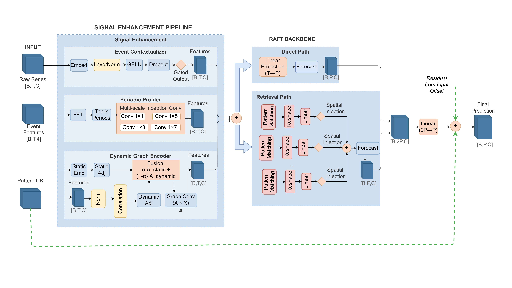
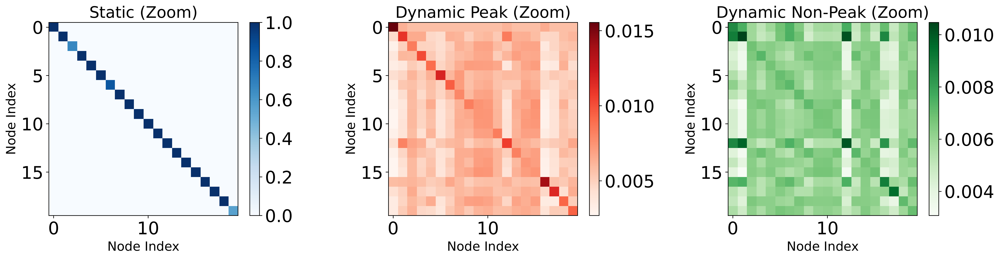
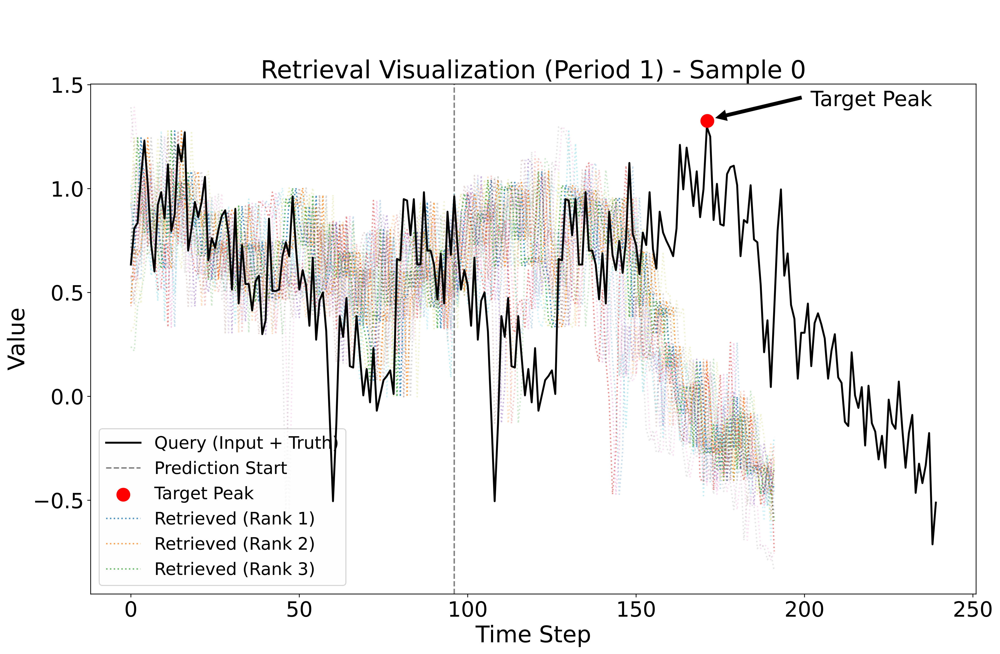
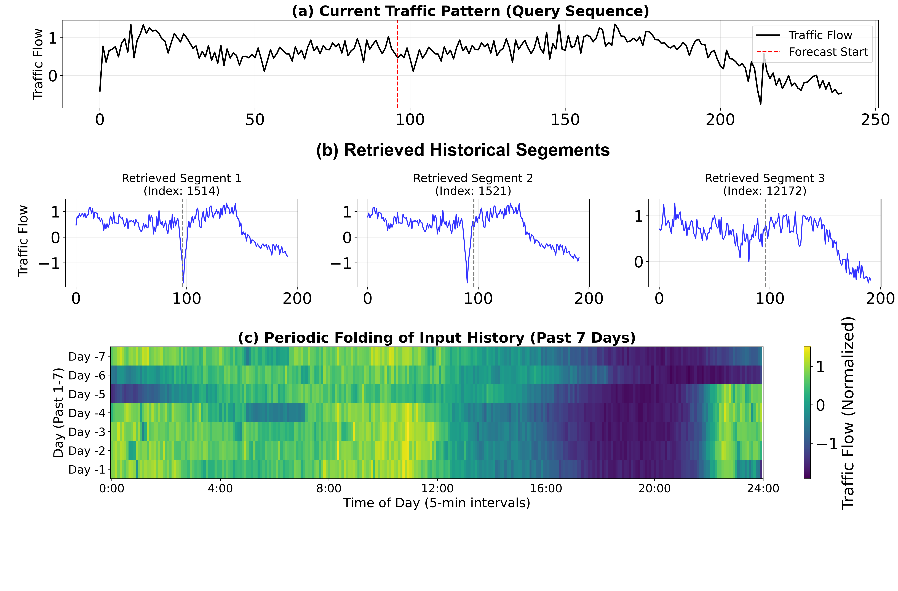

## HybridRAFT: Hybrid Retrieval-Augmented Forecasting Network for Traffic Flow Prediction

[](https://www.python.org/downloads/)
[](https://pytorch.org/)
[](LICENSE)
[](https://doi.org/10.5281/zenodo.20806264)

## Introduction

Traffic flow prediction is fundamental to intelligent transportation systems. However, existing methods face three critical challenges: (i) **calendar-driven non-stationarity** where traffic patterns vary significantly across temporal contexts, (ii) **multi-scale periodicity** spanning from hourly to weekly cycles, and (iii) **time-varying spatial dependencies** that shift with traffic conditions.

We propose **HybridRAFT**, a retrieval-augmented forecasting network that addresses these challenges by integrating three specialized modules: a **Temporal Context Encoder** with gated modulation for calendar effects, a **Periodic Profiler** with Fourier-guided 2D convolutions for multi-scale periodicity, and a **Dynamic Graph Encoder** with adaptive adjacency for evolving spatial correlations.



### Key Highlights

- **SOTA across all 24 configurations**: 3 datasets (PEMS04/07/08) × 4 prediction horizons × 2 metrics
- **4--21% MSE reduction** over state-of-the-art baselines (iTransformer, TimeMixer, DST²former)
- **Superior long-horizon stability**: Error degradation reduced from 65% to 44% (H=12 → H=96)
- **Traffic-specific design**: Three modules each address a distinct traffic forecasting challenge
- **Retrieval-augmented backbone**: Dual-path prediction combining direct and similarity-retrieved forecasts

## Architecture

HybridRAFT is built on a **main-auxiliary augmentation architecture** with four integrated components:

### Signal Enhancement Pipeline

| Module | Challenge Addressed | Key Technique |
|--------|-------------------|---------------|
| Temporal Context Encoder | Calendar-driven non-stationarity | Gated modulation: calendar features → multiplicative gates |
| Periodic Profiler | Multi-scale periodicity | DFT-guided period detection + Inception-style 2D convolutions |
| Dynamic Graph Encoder | Time-varying spatial dependencies | Static embeddings + batch-wise dynamic correlations via α-balance |

### Retrieval-Augmented Backbone

1. **Encoding**: Two-layer 1D convolution encoder projects input segments into compact latent representations
2. **Retrieval**: FAISS IVF-based index enables efficient cosine similarity search over historical patterns
3. **Dual-path prediction**: Direct forecast path + retrieval-based forecast path
4. **Fusion**: Learned attention weights combine both predictions with spatial graph injection



## Requirements

```bash
conda create -n hybridraft python=3.9
conda activate hybridraft
pip install -r requirements.txt
```

### Dependencies

- Python ≥ 3.9
- PyTorch ≥ 2.0
- NumPy, Pandas, scikit-learn, SciPy
- Matplotlib, tqdm
- sktime

## Dataset

### PEMS Traffic Datasets

| Dataset | # Sensors | Time Steps | Granularity | Source |
|---------|-----------|------------|-------------|--------|
| PEMS04 | 307 | 16,992 | 5 min | San Francisco Bay Area |
| PEMS07 | 883 | 28,224 | 5 min | San Francisco Bay Area |
| PEMS08 | 170 | 17,856 | 5 min | San Bernardino Area |

The PEMS datasets are available from the [METR-LA/PEMS-BAY repository](https://github.com/liyaguang/DCRNN). Download and place them in the `data/` directory:

```
data/
├── PEMS04/
│   └── PEMS04.csv
├── PEMS07/
│   └── PEMS07.csv
└── PEMS08/
    └── PEMS08.csv
```

The CSV should have the first column as date/time index and subsequent columns as sensor variables.

### Supported Dataset Types

- **ETT** (Electricity Transformer Temperature): ETTh1, ETTh2, ETTm1, ETTm2
- **PEMS** traffic flow datasets
- **Custom datasets**: CSV files with date index and variable columns

## Training

### Quick Start

```bash
python run.py \
    --is_training 1 \
    --root_path ./data/PEMS04/ \
    --data_path PEMS04.csv \
    --model HybridRAFT \
    --data custom \
    --features M \
    --seq_len 96 \
    --label_len 48 \
    --pred_len 96 \
    --enc_in 307 \
    --dec_in 307 \
    --c_out 307 \
    --d_model 512 \
    --d_ff 2048 \
    --n_heads 8 \
    --e_layers 2 \
    --d_layers 1 \
    --train_epochs 30 \
    --batch_size 64 \
    --learning_rate 0.0001 \
    --patience 5 \
    --loss MAE \
    --lradj cosine
```

### Training Configuration

| Parameter | Value |
|-----------|-------|
| Input Length (seq_len) | 96 (8 hours at 5-min intervals) |
| Prediction Lengths | 12 / 24 / 48 / 96 (1--8 hours) |
| Model Dimension (d_model) | 512 |
| Node Embedding Dimension | 32 |
| Retrieval Neighbors (K) | 20 |
| DFT Top-K Periods (Kp) | 3 |
| Optimizer | Adam |
| Learning Rate | 1×10⁻⁴ |
| Batch Size | 16 (PEMS04/08), 64 (PEMS07) |
| Early Stopping Patience | 5 |
| Hardware | NVIDIA A100 (for paper results) |

### Per-Dataset Training

```bash
python train_pems04.ps1
```

Or customize for each dataset by adjusting `--root_path`, `--data_path`, `--enc_in`, and `--batch_size`.

## Evaluation

```bash
python run.py \
    --is_training 0 \
    --root_path ./data/PEMS04/ \
    --data_path PEMS04.csv \
    --model HybridRAFT \
    --data custom \
    --features M \
    --seq_len 96 \
    --label_len 48 \
    --pred_len 96 \
    --enc_in 307 \
    --dec_in 307 \
    --c_out 307 \
    --d_model 512 \
    --d_ff 2048 \
    --n_heads 8 \
    --e_layers 2 \
    --d_layers 1 \
    --batch_size 64
```

## Results

### PEMS04 Benchmark

| Pred Len | MSE | MAE |
|----------|-----|-----|
| 12 | 0.0785 | 0.1810 |
| 24 | 0.1365 | 0.2557 |
| 48 | 0.1489 | 0.2874 |
| 96 | 0.1121 | 0.2257 |

### Comparison with Baselines (MSE Improvement)

| Baseline | Improvement |
|----------|-------------|
| iTransformer / TimeMixer | 7--21% MSE reduction |
| Spatio-temporal GNNs (STGCN, DCRNN, ASTGCN, AGCRN, MTGNN) | 12--36% improvement |
| Dynamic graph methods (DST²former) | 4--21% improvement |

### Long-Horizon Stability (PEMS04, H=12 → H=96 Degradation)

| Method | MSE Increase |
|--------|-------------|
| iTransformer | +293% |
| MTGNN | +98% |
| DST²former | +65% |
| **HybridRAFT** | **+44%** |

## Ablation Study

Ablation on PEMS04 at prediction length H=96:

| Variant | MSE Change | Verified Challenge |
|---------|------------|-------------------|
| w/o Temporal Context Encoder | +21.4% | H1: Calendar non-stationarity |
| w/o Periodic Profiler | +39.3% | H2: Multi-scale periodicity |
| w/o Dynamic Graph Encoder | +10.7% | H3: Time-varying spatial dependencies |
| w/o Retrieval module | +17.0% | Retrieval augmentation |
| Retrieval backbone only | +30.4% | Integrated architecture |

The **Periodic Profiler** shows the largest impact, confirming that multi-scale periodicity is the most critical challenge in traffic forecasting.





## Repository Structure

```
HybridRAFT/
├── README.md                              # This file
├── requirements.txt                       # Python dependencies
├── .gitignore                             # Git ignore rules
├── LICENSE                                # MIT License
├── run.py                                 # Main entry point (train/test)
├── train_pems04.ps1                       # Example training script
├── models/
│   ├── __init__.py
│   └── HybridRAFT.py                      # Core model definition
├── layers/
│   ├── __init__.py
│   └── Retrieval.py                       # RAFT retrieval mechanism
├── data_provider/
│   ├── __init__.py
│   ├── data_factory.py                    # DataLoader factory
│   └── data_loader.py                     # Dataset classes
├── exp/
│   ├── __init__.py
│   ├── exp_basic.py                       # Experiment base class
│   └── exp_long_term_forecasting.py       # Train/val/test pipeline
├── utils/
│   ├── __init__.py
│   ├── augmentation.py                    # Time series augmentation
│   ├── dtw.py                             # DTW distance computation
│   ├── dtw_metric.py                      # Accelerated DTW (scipy)
│   ├── metrics.py                         # MSE, MAE, RMSE, MAPE, MSPE
│   ├── timefeatures.py                    # Time feature encoding
│   ├── tools.py                           # LR scheduling, early stopping
│   └── print_args.py                      # Argument printer
└── assets/
    ├── architecture.png                   # Full architecture diagram
    ├── graph_encoder.png                  # Dynamic Graph Encoder visualization
    ├── peak_case_study.png                # Peak hour case study
    └── retrieval_case_study.png           # Retrieval mechanism case study
```

## Acknowledgements

- We thank the authors of [DCRNN](https://github.com/liyaguang/DCRNN) for the PEMS dataset preprocessing pipeline.
- We thank the [RAFT](https://github.com/) authors for the retrieval-augmented forecasting backbone.
- We thank the [TimesNet](https://github.com/thuml/TimesNet) authors for the period-reshaping insight.

## Citations

This paper has been accepted by  [IEEE SMC 2026](https://www.ieeesmc2026.org/). If you find this work helpful, please cite:

```bibtex
@inproceedings{qiu2026hybridraft,
  title={Hybrid Retrieval-Augmented Forecasting Network for Traffic Flow Prediction},
  author={Qiu, Jingxiang and Qu, Guanheng and Li, Jianrui and Liu, Jiangming},
  booktitle={},
  year={2026},
  address={Bellevue, WA, USA},
  month={October},
  url={},
  doi={},
  note={Accepted for publication},
}
```
or
```
@software{Qiu_HybridRAFT_2026,
  author = {Qiu, Jingxiang and Qu, Guanheng and Qu, Guanheng and Liu, Jiangming},
  doi = {10.5281/zenodo.20806264},
  month = jul,
  title = {{HybridRAFT}},
  url = {https://github.com/Unk1ndledAC/HybridRAFT},
  version = {1.0.2},
  year = {2026}
}

```

## License

This project is licensed under the MIT License — see the [LICENSE](LICENSE) file for details.
